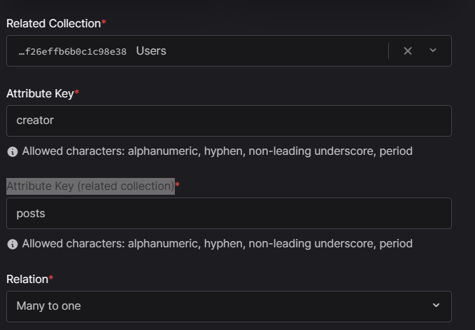

# React + TypeScript + Vite

This template provides a minimal setup to get React working in Vite with HMR and some ESLint rules.

Currently, two official plugins are available:

- [@vitejs/plugin-react](https://github.com/vitejs/vite-plugin-react/blob/main/packages/plugin-react/README.md) uses [Babel](https://babeljs.io/) for Fast Refresh
- [@vitejs/plugin-react-swc](https://github.com/vitejs/vite-plugin-react-swc) uses [SWC](https://swc.rs/) for Fast Refresh

## Expanding the ESLint configuration

If you are developing a production application, we recommend updating the configuration to enable type aware lint rules:

- Configure the top-level `parserOptions` property like this:

```js
export default {
  // other rules...
  parserOptions: {
    ecmaVersion: "latest",
    sourceType: "module",
    project: ["./tsconfig.json", "./tsconfig.node.json"],
    tsconfigRootDir: __dirname,
  },
};
```

- Replace `plugin:@typescript-eslint/recommended` to `plugin:@typescript-eslint/recommended-type-checked` or `plugin:@typescript-eslint/strict-type-checked`
- Optionally add `plugin:@typescript-eslint/stylistic-type-checked`
- Install [eslint-plugin-react](https://github.com/jsx-eslint/eslint-plugin-react) and add `plugin:react/recommended` & `plugin:react/jsx-runtime` to the `extends` list

// STEP

- install react vite
- install tailwind
- install tailwindcss animate
- install react-router-dom
- install shadcn/ui
- in tsconfig.json

  "compilerOptions": {
  // ...
  "baseUrl": ".",
  "paths": {
  "@/_": [
  "./src/_"
  ]
  }
  }

  npm i -D @types/node

- in vite.config.ts
  override
  import path from "path";
  import react from "@vitejs/plugin-react";
  import { defineConfig } from "vite";

  export default defineConfig({
  plugins: [react()],
  resolve: {
  alias: {
  "@": path.resolve(\_\_dirname, "./src"),
  },
  },
  });

- npx shadcn-ui@latest init (auto create folder components/ui)
  
- npx shadcn-ui@latest add button
- create router
  
- npx shadcn-ui@latest add form

- in SignupFrom.tsx (Zod is a validation library for JavaScript and TypeScript. This library is designed to help validate and control data in node.js and web applications.)
- add components form in SignupFrom.tsx
  
  

- setting Appwrite https://appwrite.io/ (Appwrite's open-source platform lets you add Auth, DBs, Functions and Storage to your product and build any application at any scale, own your data, and use your preferred coding languages and tools.)
- create Project with name JSM_Snapgram
- create folder appwrite in folder lib (create config.ts in appwrite)
- npm i appwrite, import and copy project id in appwrite paste to config.ts
  

- create .env.local : VITE_APPWRITE_PROJECT_ID='65f25db4277512b009ae' ;VITE_APPWRITE_URL='https://cloud.appwrite.io/v1'

- create api.ts in appwrite
  

- crate folder types in src (types of TypeScript)

- when you submit form in signup,Then go to the appwrite check page in the auth section and you will see the information you just submitted
  

- in appwrite create bucket in tab storage with name is media to save image of user
- .env.local : VITE_APPWRITE_STORAGE_ID='65f26c9771e39b7477ca'

- in appwrite create Database in tab Database with name is Snapgram
- .env.local : VITE_APPWRITE_DATABASE_ID='65f26d9f4b8015c6acc2'

- in database create collection :Posts ,Users ,Saves and updates permissions in settings
  

- create relationship in collection
- go to Posts, goto tab Attributes and click crate attribute then click Relationship, choose Two-way relationship and related collection is Users, Attribute key is creator,Attribute Key (related collection) is posts, relation is Many to one.
  On deleting a document: Set null- set document ID as null in all related documents
  => posts can contain one creator
  creator can belong to many posts
  

- go to Posts, goto tab Attributes and click crate attribute then click Relationship, choose Two-way relationship and related collection is Users, Attribute key is likes,Attribute Key (related collection) is liked, relation is Many to Many.
  On deleting a document: Set null- set document ID as null in all related documents
  => 1 post - many like from users
  1 user - many likes posts
  

- create attribute of posts
  
- create indexs of posts ( search caption)
  

- create attribute of User
  

- go to Saves, goto tab Attributes and click crate attribute then click Relationship, choose Two-way relationship and related collection is Users, Attribute key is user,Attribute Key (related collection) is save, relation is Many to one.
  On deleting a document: Set null- set document ID as null in all related documents
  => 1 saves posts - from 1 users
  1 user - many saves posts
  

- go to Saves, goto tab Attributes and click crate attribute then click Relationship, choose Two-way relationship and related collection is Posts, Attribute key is post,Attribute Key (related collection) is save, relation is Many to one.
  On deleting a document: Set null- set document ID as null in all related documents
  => 1 saves posts - from 1 post
  1 post - many saves posts
  

- copy id of collection, database,... to .env.local
  VITE_APPWRITE_URL='https://cloud.appwrite.io/v1'
  VITE_APPWRITE_PROJECT_ID='65f25db4277512b009ae'
  VITE_APPWRITE_DATABASE_ID='65f26d9f4b8015c6acc2'
  VITE_APPWRITE_STORAGE_ID='65f26c9771e39b7477ca'
  VITE_APPWRITE_USER_COLLECTION_ID='65f26e14bd15089377cd'
  VITE_APPWRITE_POSTS_COLLECTION_ID='65f26effb6b0c1c98e38'
  VITE_APPWRITE_SAVES_COLLECTION_ID='65f26f41b5d3d798aac4'
- in config.ts
  

- in api.ts
  add function to create user and save to db
  
  

- npx shadcn-ui@latest add toast

- in signUpForm.tsx
  

- create lib/react-query/queriesAndMutations.ts
- npm i @tanstack/react-query
- config function createUser, signIn in api.ts
  

- create react-query folder
  in queriesAndMutations.ts (config react query)
  

- npm i react-dropzone
