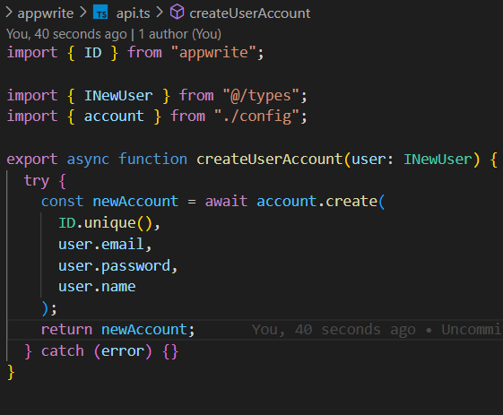

# React + TypeScript + Vite

This template provides a minimal setup to get React working in Vite with HMR and some ESLint rules.

Currently, two official plugins are available:

- [@vitejs/plugin-react](https://github.com/vitejs/vite-plugin-react/blob/main/packages/plugin-react/README.md) uses [Babel](https://babeljs.io/) for Fast Refresh
- [@vitejs/plugin-react-swc](https://github.com/vitejs/vite-plugin-react-swc) uses [SWC](https://swc.rs/) for Fast Refresh

## Expanding the ESLint configuration

If you are developing a production application, we recommend updating the configuration to enable type aware lint rules:

- Configure the top-level `parserOptions` property like this:

```js
export default {
  // other rules...
  parserOptions: {
    ecmaVersion: "latest",
    sourceType: "module",
    project: ["./tsconfig.json", "./tsconfig.node.json"],
    tsconfigRootDir: __dirname,
  },
};
```

- Replace `plugin:@typescript-eslint/recommended` to `plugin:@typescript-eslint/recommended-type-checked` or `plugin:@typescript-eslint/strict-type-checked`
- Optionally add `plugin:@typescript-eslint/stylistic-type-checked`
- Install [eslint-plugin-react](https://github.com/jsx-eslint/eslint-plugin-react) and add `plugin:react/recommended` & `plugin:react/jsx-runtime` to the `extends` list

// STEP

- install react vite
- install tailwind
- install tailwindcss animate
- install react-router-dom
- install shadcn/ui
- in tsconfig.json

  "compilerOptions": {
  // ...
  "baseUrl": ".",
  "paths": {
  "@/_": [
  "./src/_"
  ]
  }
  }

  npm i -D @types/node

- in vite.config.ts
  override
  import path from "path";
  import react from "@vitejs/plugin-react";
  import { defineConfig } from "vite";

  export default defineConfig({
  plugins: [react()],
  resolve: {
  alias: {
  "@": path.resolve(\_\_dirname, "./src"),
  },
  },
  });

- npx shadcn-ui@latest init (auto create folder components/ui)
  
- npx shadcn-ui@latest add button
- create router
  
- npx shadcn-ui@latest add form

- in SignupFrom.tsx (Zod is a validation library for JavaScript and TypeScript. This library is designed to help validate and control data in node.js and web applications.)
- add components form in SignupFrom.tsx
  

- setting Appwrite https://appwrite.io/ (Appwrite's open-source platform lets you add Auth, DBs, Functions and Storage to your product and build any application at any scale, own your data, and use your preferred coding languages and tools.)
- create Project with name JSM_Snapgram
- create folder appwrite in folder lib (create config.ts in appwrite)
- npm i appwrite, import and copy project id in appwrite paste to config.ts 

- create .env.local : VITE_APPWRITE_PROJECT_ID='65f25db4277512b009ae' ;VITE_APPWRITE_URL='https://cloud.appwrite.io/v1'

- create api.ts in appwrite 

- crate folder types in src (types of TypeScript)
